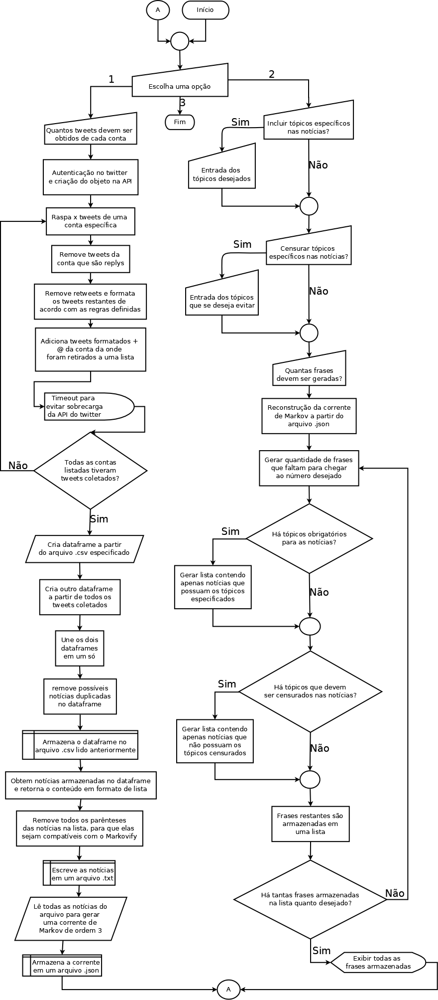

  

<h1>O Projeto</h1>

A Gazeta Robótica começou com a vontade de parodiar a "realidade surreal" em que vivemos, pegando notícias reais e gerando combinações aleatórias para tentar simular manchetes aparentemente nonsense e/ou cómicas, como *"Aluno leva choque na UFPE e colegas aplaudem pensando ser performance"*, *"Funcionária de tribunal usou dinheiro público para comprar terno para cachorro"* e *"Deitado em rede, advogado participa de sessão de julgamento do TJ da Bahia"*.

O bot 'raspa' notícias de perfis de grandes portais no twitter para alimentar uma corrente de Markov, uma estrutura que quantifica padrões para tornar as sentenças geradas mais semelhantes ao que foi absorvido, e então cria frases juntando partes aleatórias das notícias. Além disso, esse script pode criar sentenças dentro de um tópico específico ou censurar palavras desejadas pelo usuário.

<h1>Componentes</h1>

* Re - Formatar e remover conteudo indesejável das frases coletadas
* Pandas - Armazenamento e manipulação de dados
* Tweepy - Realizar chamadas para a API do Twitter
* Markovify - Geração da Corrente de Markov e das notícias falsas

<h1>Outros</h1>

Para mais detalhes sobre esse projeto, acesse a [pagina no Github](https://github.com/arthur-sm/Gazeta-Robotica) ou o artigo ["Usando Corrente de Markov para gerar Notícias Falsas"](https://www.in-senso.com.br/2020/12/gr-devlog1.html).

Vai aqui um diagrama que procura explicar o funcionamento do script:

Alt: [Fluxograma que explica o funcionamento geral do script](url)

